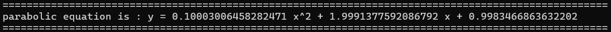
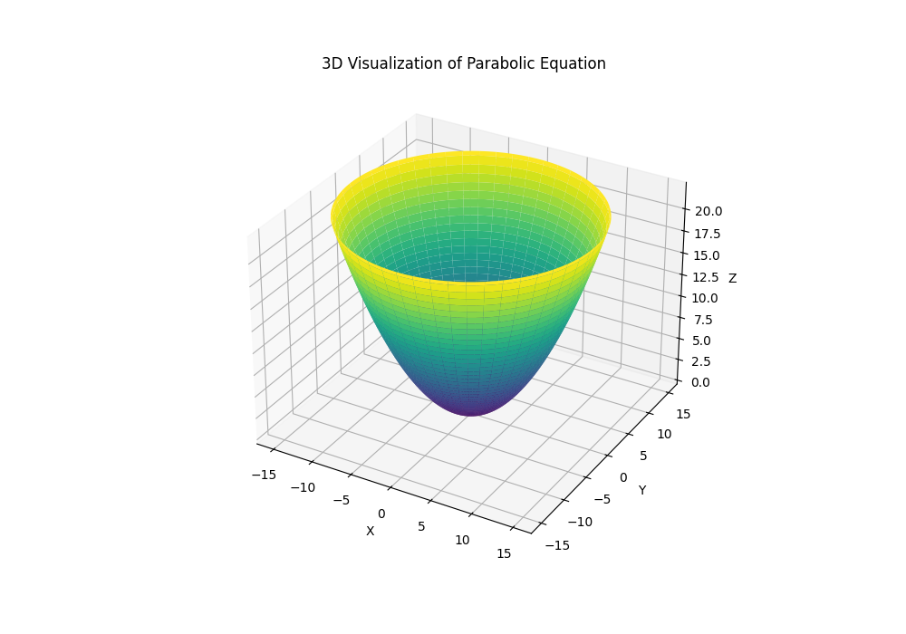

# Fukuro Regression
Fukuro is a part of the Gadjah Mada Robotic Team from Gadjah Mada University, commonly known as UGM. Fukuro is tasked with representing UGM in the KRI competition's wheeled soccer branch. Throughout the development process, we have encountered several challenges, including difficulty in determining the mathematical equations for parabolic mirrors.

The main goal of this repository is to assist in generating mathematical equations based on user-provided input data (*.csv).

## Table of Contents

- [Fukuro Regression](#project-name)
  - [Table of Contents](#table-of-contents)
  - [Prerequisites](#prerequisites)
  - [Installation](#installation)
  - [Guides](#guides)
  - [Output](#output)

## Prerequisites
Get the data and make it in .csv with column X and y.
Save csv in `../FukuroRegression/data/`

## Installation
Before executing the code, install the dependencies using `requirements.txt`
```
    cd FukuroRegression
    pip install -r requirements.txt
```

## Guides
Execute this command after `cd FukruoRegression`
```
    python src/main.py --f CSV_FILE -t MODEL_TYPE -m MODE
```

CSV_FILE: filename.csv
MODEL_TYPE: linear or parabolic
MODE: trainig or testing

Example:
```
    python src/main.py --f input.csv -t parabolic -m training
```

## Output 
Output equation:

Output 3D plot:
